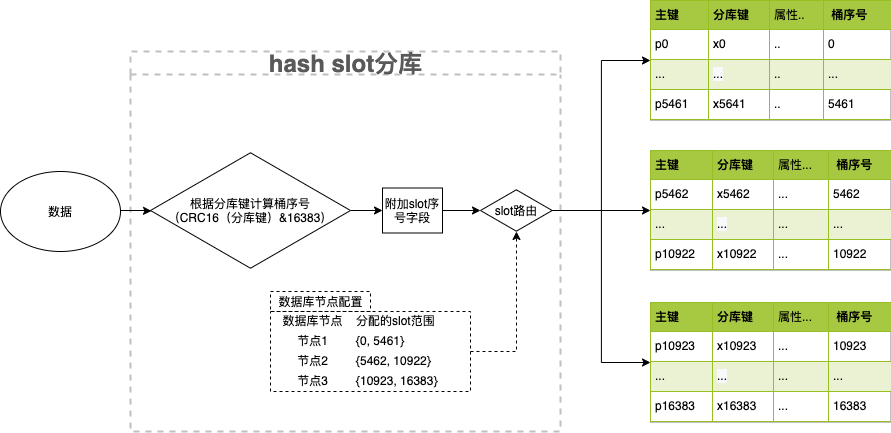

# slot分库逻辑



slot分库路由引入中间虚拟层，把数据散列分布范围抽象成16384个hash块，根据数据节点权重情况分配16384个数据块到每个数据库节点；

实际数据根据分库键字段值计算出对应的slot序号，依据slot分配策略路由数据到slot序号对应的数据节点；

slot序号计算：
````
slot序号 = CRC16（分库键值）&16383
````

# 添加依赖

````
<dependency>
    <groupId>com.rlynic</groupId>
    <artifactId>sharding-slot-database</artifactId>
    <version>1.0.0</version>
</dependency>

<distributionManagement>
    <repository>
        <id>rdc-releases</id>
        <url>https://packages.aliyun.com/maven/repository/2012941-release-2jivvD/</url>
    </repository>
</distributionManagement>

````

# slot路由配置

````
#hash slot分配配置
slot.sharding.range.datasource.ds_0={0, 5461}
slot.sharding.range.datasource.ds_1={5462, 10922}
slot.sharding.range.datasource.ds_2={10923, 16383}

# 指定slot分库算法
spring.shardingsphere.sharding.default-database-strategy.standard.precise-algorithm-class-name=com.rlynic.sharding.slot.database.strategy.HashSlotShardingAlgorithm

````

# 模型规范

为应对后期的节点自动扩容和缩减，采用slot分库方式的相关模型，需要配置slot序号字段，用于存储数据对应的slot序号值（slot字段值会自动填充）

字段格式：
````
slot INT NULL COMMENT 'slot序号'
````